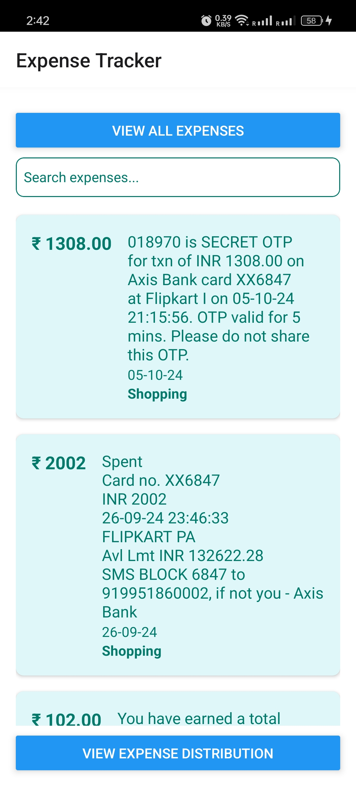
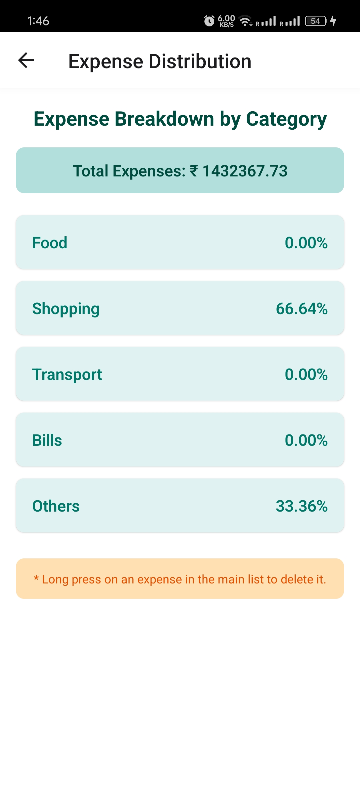

# 📊 Expense Tracker App

## 🚀 Introduction
The **Expense Tracker App** is a React Native application designed to help users track their expenses effortlessly by reading SMS messages related to transactions. With a user-friendly interface and real-time updates, you can stay on top of your finances.

## 🛠️ Features
- **SMS Integration**: Automatically fetches SMS messages related to expenses.
- **Expense Categorization**: Categorizes expenses into different categories such as Food, Transport, Bills, and more.
- **Search Functionality**: Easily search and filter expenses by keywords.
- **Data Storage**: Saves expense data locally using AsyncStorage.
- **User-Friendly Interface**: Intuitive design for seamless navigation.

## 📱 Usage
1. **Launch the App**: Open the Expense Tracker App on your device.
2. **Grant Permissions**: When prompted, grant the app permission to read your SMS messages. This is essential for fetching transaction details.
3. **View Transactions**: The app will automatically fetch and display your transaction messages from your SMS inbox. You can easily see all your expenses in one place.
4. **Search for Expenses**: Use the search bar to filter and find specific expenses quickly. Type in keywords related to your expenses, and the app will show matching results.
5. **View Details**: Tap on any expense to view detailed information, including the amount, date, and description.

## 📸 Screenshots
Here are some screenshots of the app in action:

### Home Screen

*Home Screen - View all your expenses*

### Expense Details Screen

*Expense Details - View detailed information about your expenses*
